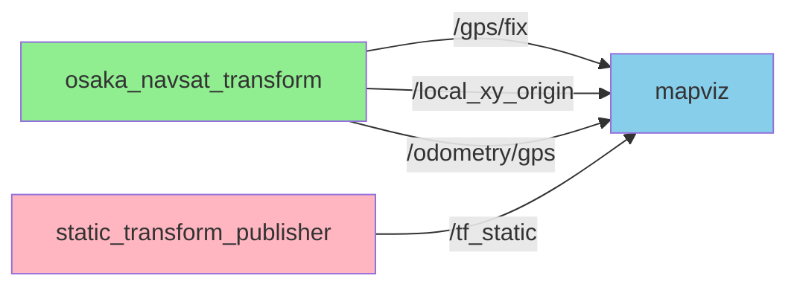
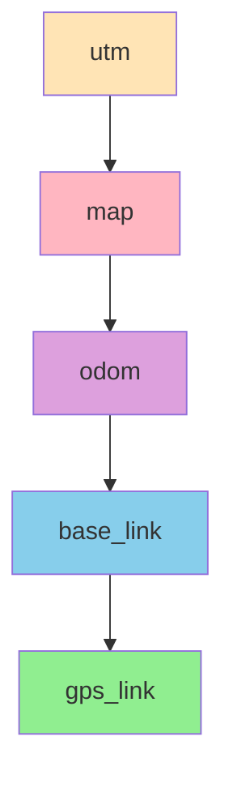
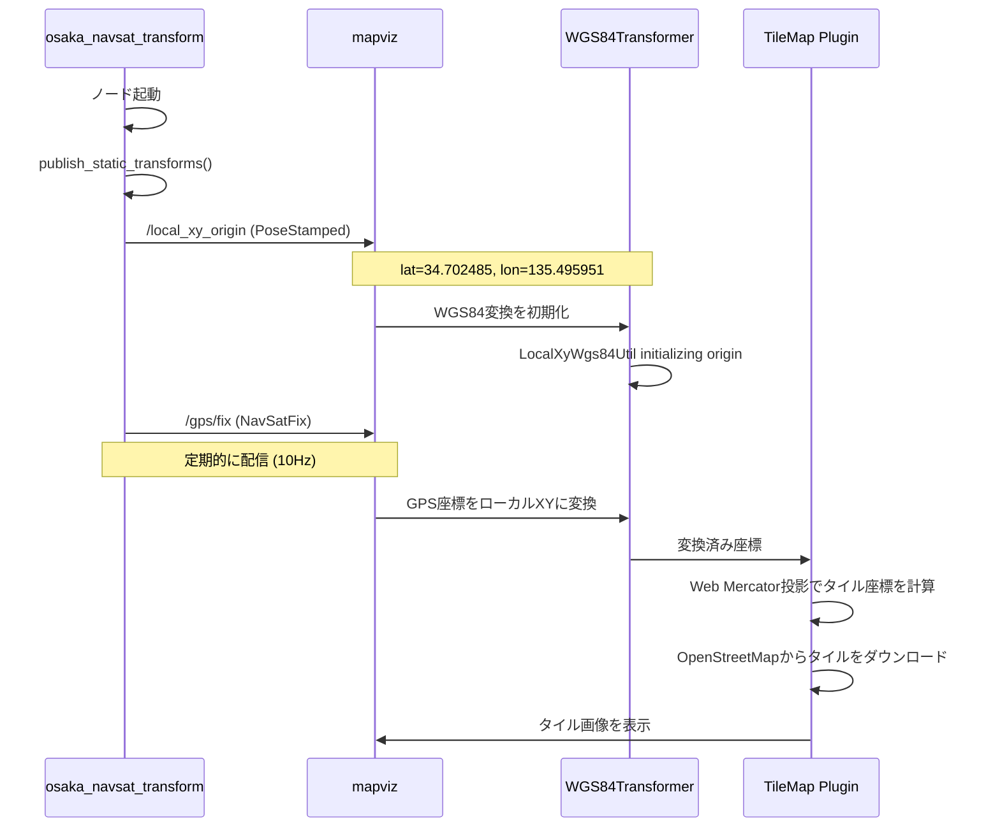
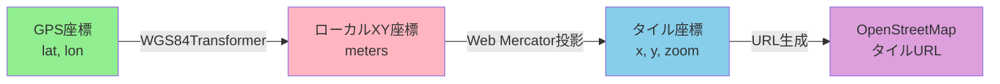
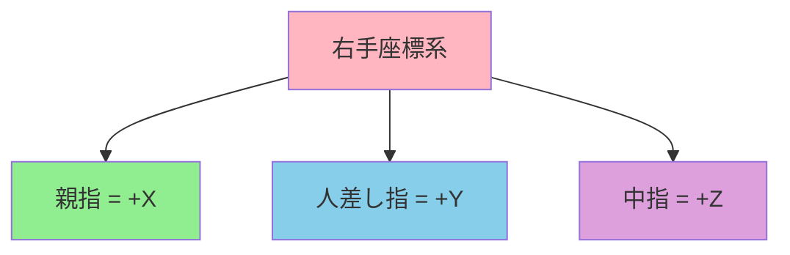

# Mapviz 地図タイル表示ガイド

## 概要

[mapviz](https://github.com/swri-robotics/mapviz)で[OpenStreetMap](https://www.openstreetmap.org/)などの地図タイルを表示するために必要な設定と仕組みをまとめた資料です。

## 参考リンク

- [mapviz GitHubリポジトリ](https://github.com/swri-robotics/mapviz)
- [swri_transform_util (marti_common)](https://github.com/swri-robotics/marti_common)
- [REP 103: Standard Units of Measure and Coordinate Conventions](https://www.ros.org/reps/rep-0103.html)
- [OpenStreetMap](https://www.openstreetmap.org/)
- [Web Mercator投影](https://en.wikipedia.org/wiki/Web_Mercator_projection)

---

## システムアーキテクチャ

### Topic接続図



### TF変換ツリー



---

## データフロー

### 段階的な初期化プロセス



---

## メッセージ型と期待値

### 1. `/local_xy_origin` トピック

**メッセージ型:** `geometry_msgs/msg/PoseStamped`

**重要:** PoseStampedを使う場合、position.xとposition.yには**GPS座標（度）**を設定する

```yaml
header:
  stamp: [現在時刻]
  frame_id: "map"
pose:
  position:
    x: 135.495951    # 経度 (longitude, degrees) ← 注意：通常のREP103と異なる
    y: 34.702485     # 緯度 (latitude, degrees)
    z: 5.0           # 高度 (altitude, meters)
  orientation:
    w: 1.0
```

**公式仕様（[marti_common Issue #246](https://github.com/swri-robotics/marti_common/issues/246)より）:**
- `pose.position.x` = 経度（longitude）
- `pose.position.y` = 緯度（latitude）
- `pose.position.z` = 高度（altitude）
- ソースコード: [local_xy_util.cpp](https://github.com/swri-robotics/marti_common/blob/master/swri_transform_util/src/local_xy_util.cpp)

**なぜ[REP 103](https://www.ros.org/reps/rep-0103.html)と異なるのか:**
- REP 103では、`position.x`と`position.y`は通常メートル単位のローカル座標（East/North）
- `/local_xy_origin`は初期化パラメータとして使用されるため、GPS座標（度）を直接格納
- これにより、[swri_transform_util](https://github.com/swri-robotics/marti_common/tree/master/swri_transform_util)のLocalXyWgs84Utilが座標系の原点を初期化可能

**代替案:** `geographic_msgs/msg/GeoPoint` (より明示的)

```yaml
latitude: 34.702485   # 緯度
longitude: 135.495951 # 経度
altitude: 5.0         # 高度
```

**QoS設定:**
- Durability: `TRANSIENT_LOCAL` (mapviz起動後でもメッセージを受信できるように)
- Depth: 1

### 2. `/gps/fix` トピック

**メッセージ型:** [`sensor_msgs/msg/NavSatFix`](https://docs.ros2.org/latest/api/sensor_msgs/msg/NavSatFix.html)

```yaml
header:
  stamp: [現在時刻]
  frame_id: "gps_link"
latitude: 34.702485      # 緯度
longitude: 135.495951    # 経度
altitude: 5.0            # 高度
status:
  status: 0              # STATUS_FIX (GPS fix取得済み)
  service: 1             # SERVICE_GPS
position_covariance: [1.0, 0.0, 0.0, 0.0, 1.0, 0.0, 0.0, 0.0, 1.0]
position_covariance_type: 2  # COVARIANCE_TYPE_DIAGONAL_KNOWN
```

**配信頻度:** 10Hz推奨

### 3. TF変換

**必須の変換チェーン:**

```
utm → map → odom → base_link → gps_link
```

**各変換の設定例:**

```python
# utm → map (大阪駅の場合、原点なので単位行列)
t = TransformStamped()
t.header.frame_id = 'utm'
t.child_frame_id = 'map'
t.transform.translation.x = 0.0
t.transform.translation.y = 0.0
t.transform.translation.z = 0.0
t.transform.rotation.w = 1.0

# map → odom (単位行列)
t.header.frame_id = 'map'
t.child_frame_id = 'odom'
# ... (同様)

# odom → base_link (単位行列)
t.header.frame_id = 'odom'
t.child_frame_id = 'base_link'
# ...

# base_link → gps_link (単位行列)
t.header.frame_id = 'base_link'
t.child_frame_id = 'gps_link'
# ...
```

---

## 座標変換の仕組み

### GPS座標からタイル座標への変換



### 1. WGS84 → ローカルXY変換

mapvizの`LocalXyWgs84Util`が実行：

```python
# 簡易的な等距円筒図法 (Equirectangular projection)
R = 6378137.0  # 地球半径 (m)

lat_rad = math.radians(lat)
lon_rad = math.radians(lon)
lat0_rad = math.radians(origin_lat)  # 原点緯度
lon0_rad = math.radians(origin_lon)  # 原点経度

x = R * (lon_rad - lon0_rad) * math.cos(lat0_rad)
y = R * (lat_rad - lat0_rad)
```

### 2. ローカルXY → [Web Mercator](https://en.wikipedia.org/wiki/Web_Mercator_projection) → タイル座標

```python
# Web Mercator投影
def latlon_to_web_mercator(lat, lon):
    x = lon
    y = math.log(math.tan(math.radians(lat)) + 1/math.cos(math.radians(lat)))
    return x, y

# タイル番号計算
def web_mercator_to_tile(x, y, zoom):
    n = 2 ** zoom
    tile_x = int((x + 180.0) / 360.0 * n)
    tile_y = int((1.0 - y / math.pi) / 2.0 * n)
    return tile_x, tile_y
```

### 3. タイルURL生成

**OpenStreetMapの場合:**

```
https://tile.openstreetmap.org/{zoom}/{tile_x}/{tile_y}.png
```

例: 大阪駅周辺 (zoom=15)
```
https://tile.openstreetmap.org/15/29084/12945.png
```

**国土地理院（GSI）の場合:**

国土地理院では複数の地図タイプを提供しています：

```
# 標準地図
https://cyberjapandata.gsi.go.jp/xyz/std/{level}/{x}/{y}.png

# 淡色地図
https://cyberjapandata.gsi.go.jp/xyz/pale/{level}/{x}/{y}.png

# 英語版地図
https://cyberjapandata.gsi.go.jp/xyz/english/{level}/{x}/{y}.png

# 航空写真
https://cyberjapandata.gsi.go.jp/xyz/seamlessphoto/{level}/{x}/{y}.jpg
```

参考: [地理院タイル一覧](https://maps.gsi.go.jp/development/ichiran.html)

---

## Mapviz設定ファイル (.mvc)

### 最小構成

```yaml
capture_directory: "~"
fixed_frame: map
target_frame: map
fix_orientation: false
rotate_90: false
enable_antialiasing: true
show_displays: true
show_status_bar: true
show_capture_tools: true
window_width: 1280
window_height: 720
view_scale: 0.5
offset_x: 0
offset_y: 0
use_latest_transforms: true
background: "#a0a0a4"
image_transport: raw
displays:
  - type: mapviz_plugins/tile_map
    name: Tile Map
    config:
      visible: true
      collapsed: false
      custom_sources:
        - base_url: https://tile.openstreetmap.org/{level}/{x}/{y}.png
          max_zoom: 19
          name: OpenStreetMap
      bing_api_key: ""
      source: OpenStreetMap
  - type: mapviz_plugins/navsat
    name: GPS - Osaka Station
    config:
      visible: true
      collapsed: false
      topic: /gps/fix
      color: "#ff0000"
      draw_style: points
      position_tolerance: 0.0
      buffer_size: 100
```

### 重要なパラメータ

| パラメータ | 説明 | 推奨値 |
|----------|------|--------|
| `fixed_frame` | 固定フレーム | `map` |
| `target_frame` | ターゲットフレーム | `map` または `base_link` |
| `view_scale` | 表示スケール (m/pixel) | 0.5 (初期値) |
| `use_latest_transforms` | 最新のTF変換を使用 | `true` |

---

## トラブルシューティング

### 問題1: タイルが表示されない

**症状:**
```
[ERROR] No origin initialized; dropping messages
[WARN] Wgs84Transformer not initialized
```

**原因:** `/local_xy_origin`が配信されていない、または値が不正

**解決策:**
1. `/local_xy_origin`トピックが配信されているか確認
   ```bash
   ros2 topic echo /local_xy_origin --once
   ```
2. position.x（経度）とposition.y（緯度）が正しいGPS座標か確認
3. QoSのDurabilityが`TRANSIENT_LOCAL`に設定されているか確認

### 問題2: "No transform between wgs84 and map"

**症状:**
```
[ERROR] No transform between wgs84 and map
```

**原因:** TF変換ツリーが不完全

**解決策:**
1. TF変換を確認
   ```bash
   ros2 run tf2_tools view_frames
   ```
2. 必要な変換チェーンを確認: `utm → map → odom → base_link → gps_link`
3. StaticTransformBroadcasterで静的変換を配信

### 問題3: GPSマーカーは表示されるがタイルが表示されない

**症状:** 赤い点は表示されるが地図タイルが表示されない

**原因:**
- `/local_xy_origin`のposition.xとposition.yにUTM座標を設定している
- 経度と緯度を逆に設定している

**解決策:**
```python
# ❌ 間違い: UTM座標を設定
origin_msg.pose.position.x = utm_x
origin_msg.pose.position.y = utm_y

# ✅ 正しい: GPS座標を設定
origin_msg.pose.position.x = longitude  # 経度
origin_msg.pose.position.y = latitude   # 緯度
```

### 問題4: タイルURLが404エラー

**症状:** タイルダウンロードが失敗

**原因:**
- Stamen Terrainなど、サービス終了したタイルサーバーを使用
- URLフォーマットが不正

**解決策:**
OpenStreetMapなど、現在稼働中のタイルサーバーを使用：
```yaml
custom_sources:
  - base_url: https://tile.openstreetmap.org/{level}/{x}/{y}.png
    max_zoom: 19
    name: OpenStreetMap
```

---

## 実装例

### 完全なNavSatTransformノード

`osaka_navsat_transform.py`の実装ポイント：

```python
#!/usr/bin/env python3
import rclpy
from rclpy.node import Node
from sensor_msgs.msg import NavSatFix
from geometry_msgs.msg import PoseStamped
from tf2_ros import StaticTransformBroadcaster
from rclpy.qos import QoSProfile, DurabilityPolicy
import math

class OsakaNavSatTransform(Node):
    def __init__(self):
        super().__init__('osaka_navsat_transform')

        # 大阪駅の座標
        self.datum_lat = 34.702485
        self.datum_lon = 135.495951
        self.datum_alt = 5.0

        # QoS: TRANSIENT_LOCALで後から起動したmapvizにも配信
        origin_qos = QoSProfile(depth=1, durability=DurabilityPolicy.TRANSIENT_LOCAL)

        # Publishers
        self.origin_publisher = self.create_publisher(
            PoseStamped, '/local_xy_origin', origin_qos)
        self.gps_publisher = self.create_publisher(
            NavSatFix, '/gps/fix', 10)

        # TF broadcaster
        self.static_tf_broadcaster = StaticTransformBroadcaster(self)

        # 初期化
        self.publish_static_transforms()
        self.publish_origin()

        # 定期配信
        self.timer = self.create_timer(0.1, self.publish_gps)

    def publish_origin(self):
        """WGS84変換の原点を配信"""
        origin_msg = PoseStamped()
        origin_msg.header.stamp = self.get_clock().now().to_msg()
        origin_msg.header.frame_id = 'map'

        # 重要: position.x = 経度, position.y = 緯度
        origin_msg.pose.position.x = self.datum_lon
        origin_msg.pose.position.y = self.datum_lat
        origin_msg.pose.position.z = self.datum_alt
        origin_msg.pose.orientation.w = 1.0

        self.origin_publisher.publish(origin_msg)
        self.get_logger().info(
            f'Published local_xy_origin: lat={self.datum_lat}, '
            f'lon={self.datum_lon}, alt={self.datum_alt}')

    def publish_static_transforms(self):
        """静的TF変換を配信"""
        # utm → map → odom → base_link → gps_link
        # 実装省略（全て単位行列）
        pass

    def publish_gps(self):
        """GPS fixを配信"""
        gps_msg = NavSatFix()
        gps_msg.header.stamp = self.get_clock().now().to_msg()
        gps_msg.header.frame_id = 'gps_link'
        gps_msg.latitude = self.datum_lat
        gps_msg.longitude = self.datum_lon
        gps_msg.altitude = self.datum_alt
        gps_msg.status.status = 0  # STATUS_FIX
        gps_msg.status.service = 1  # SERVICE_GPS

        self.gps_publisher.publish(gps_msg)
```

---

## 起動方法

### 1. NavSatTransformノードを起動

```bash
python3 /home/taro/temp2/osaka_navsat_transform.py
```

### 2. mapvizを起動

```bash
ros2 run mapviz mapviz --load /home/taro/temp2/mapviz_osaka.mvc
```

**国土地理院の地図を使用する場合:**

```bash
# GPSデータ配信ノードを起動
python3 osaka_navsat_transform.py

# mapvizを国土地理院タイル設定で起動
ros2 run mapviz mapviz --load /home/taro/temp2/mapviz_osaka_gsi.mvc
```

### 3. 確認コマンド

```bash
# /local_xy_originを確認
ros2 topic echo /local_xy_origin --once

# GPS fixを確認
ros2 topic echo /gps/fix --once

# TF変換ツリーを確認
ros2 run tf2_tools view_frames
```

---

## REP 103: 標準座標フレーム規約

### REP 103とは

**REP 103 (ROS Enhancement Proposal 103)** は、ROSにおける標準的な座標フレーム規約を定義した文書です。

参考: https://www.ros.org/reps/rep-0103.html

### REP 103の座標系定義

#### 右手座標系

ROSでは**右手座標系**を使用：
- 親指をx軸の正方向に向ける
- 人差し指をy軸の正方向に向ける
- 中指（親指と人差し指に垂直）がz軸の正方向



#### 標準フレームの軸定義

| フレーム | X軸 | Y軸 | Z軸 |
|---------|-----|-----|-----|
| **map** | 東 (East) | 北 (North) | 上 (Up) |
| **odom** | 東 (East) | 北 (North) | 上 (Up) |
| **base_link** | 前方 (Forward) | 左 (Left) | 上 (Up) |
| **camera** | 右 (Right) | 下 (Down) | 前方 (Forward) |

#### ENU座標系 (East-North-Up)

地理座標系では**ENU**を使用：
- **X軸**: 東 (East)
- **Y軸**: 北 (North)
- **Z軸**: 上 (Up)

```
       North (Y)
          ↑
          |
          |
          +-----→ East (X)
         /
        /
       ↓
      Up (Z)
```

### REP 103とmapvizの違い

#### 標準のREP 103座標系

```python
# REP 103に従った一般的な実装
pose.position.x = east_meters   # 東方向の距離 (m)
pose.position.y = north_meters  # 北方向の距離 (m)
pose.position.z = altitude      # 高度 (m)
```

#### mapvizの`/local_xy_origin`の特殊な解釈

```python
# mapvizのWGS84Transformerでの解釈
pose.position.x = longitude  # 経度 (degrees) ← REP 103と異なる！
pose.position.y = latitude   # 緯度 (degrees) ← REP 103と異なる！
pose.position.z = altitude   # 高度 (m)
```

### なぜmapvizは異なる解釈をするのか

mapvizの`/local_xy_origin`は**初期化パラメータ**として使用されるため、メートル単位の座標ではなく、GPS座標（度）を直接受け取る設計になっています。

```mermaid
graph LR
    A[/local_xy_origin] -->|latitude, longitude| B[WGS84Transformer]
    B -->|初期化| C[原点設定]
    D[/gps/fix] -->|NavSatFix| B
    B -->|変換| E[ローカルXY座標<br/>REP 103準拠]

    style A fill:#FFB6C1
    style B fill:#87CEEB
    style C fill:#90EE90
    style D fill:#DDA0DD
    style E fill:#FFE4B5
```

**重要:** `/local_xy_origin`を受け取った後、mapviz内部ではREP 103に従ったENU座標系（X=東、Y=北、Z=上）で計算されます。

### REP 103準拠の実装例

#### 通常のPoseStamped (REP 103準拠)

```python
# ロボットの位置 (ローカルXY座標、メートル単位)
pose_msg = PoseStamped()
pose_msg.header.frame_id = 'map'

# REP 103: X=東, Y=北, Z=上
pose_msg.pose.position.x = 100.5   # 東方向に100.5m
pose_msg.pose.position.y = 50.2    # 北方向に50.2m
pose_msg.pose.position.z = 10.0    # 高度10m
```

#### mapvizの/local_xy_origin (特殊)

```python
# WGS84原点の設定 (GPS座標、度単位)
origin_msg = PoseStamped()
origin_msg.header.frame_id = 'map'

# mapviz特有: position = GPS座標 (度)
origin_msg.pose.position.x = 135.495951  # 経度
origin_msg.pose.position.y = 34.702485   # 緯度
origin_msg.pose.position.z = 5.0         # 高度 (m)
```

### 回転の表現 (Quaternion)

REP 103では、回転は**クォータニオン**で表現：

```python
# 回転なし（単位クォータニオン）
pose.orientation.x = 0.0
pose.orientation.y = 0.0
pose.orientation.z = 0.0
pose.orientation.w = 1.0

# 回転の計算例
from tf_transformations import quaternion_from_euler

# Z軸周りに90度回転 (ヨー角)
roll = 0.0
pitch = 0.0
yaw = math.pi / 2  # 90度 = π/2ラジアン

q = quaternion_from_euler(roll, pitch, yaw)
pose.orientation.x = q[0]
pose.orientation.y = q[1]
pose.orientation.z = q[2]
pose.orientation.w = q[3]
```

### フレーム命名規約

REP 103推奨のフレーム名：

| フレーム名 | 説明 |
|-----------|------|
| `map` | 固定されたグローバルフレーム（原点は任意） |
| `odom` | ロボットの連続的なローカル座標（ドリフトあり） |
| `base_link` | ロボット本体の中心 |
| `base_footprint` | ロボットの地面投影点 |
| `laser` | レーザースキャナ |
| `camera_link` | カメラ |
| `gps_link` | GPSアンテナ |

### REP 103チェックリスト

mapvizでGPS座標を扱う際の確認事項：

- ✅ TF変換ツリーは右手座標系に従っているか
- ✅ `map`フレームはENU（X=東、Y=北、Z=上）か
- ✅ `/local_xy_origin`にはGPS座標（経度・緯度）を設定しているか
- ✅ `/gps/fix`のframe_idは`gps_link`か
- ✅ クォータニオンは正規化されているか（w²+x²+y²+z²=1）

---

## 重要な発見

### 1. PoseStampedの使い方が特殊（REP 103との違い）

mapvizのWGS84変換では、`PoseStamped`のposition.xとposition.yを以下のように解釈：

- **position.x = 経度 (longitude)** ← REP 103と異なる！
- **position.y = 緯度 (latitude)** ← REP 103と異なる！
- **position.z = 高度 (altitude)**

**REP 103準拠の一般的な実装:**
- position.x = 東方向の距離 (meters)
- position.y = 北方向の距離 (meters)
- position.z = 高度 (meters)

**mapvizの`/local_xy_origin`の実装:**
- position.x = 経度 (degrees)
- position.y = 緯度 (degrees)
- position.z = 高度 (meters)

この違いは、`/local_xy_origin`が**初期化パラメータ**として使われるためです。内部計算ではREP 103に従います。

### 2. TRANSIENT_LOCALの重要性

`/local_xy_origin`は一度だけ配信すれば良いが、mapvizが後から起動することを考慮して`TRANSIENT_LOCAL`を使用する必要がある。

### 3. Web Mercatorの制約

- Web Mercator投影は緯度±85度付近で歪みが大きい
- 極地方では使用不可
- 距離や面積の正確な測定には向かない

### 4. タイルサーバーの選択

2023年以降、以下のサービスが終了：
- Stamen Terrain
- Stamen Toner
- Stamen Watercolor

推奨タイルサーバー：
- **OpenStreetMap**: https://tile.openstreetmap.org/{level}/{x}/{y}.png
  - 無料、利用規約あり
  - max_zoom: 19
- **他の選択肢**: CartoDB、Mapbox（APIキー必要）

---

## まとめ

mapvizで地図タイルを表示するには：

1. ✅ `/local_xy_origin` (PoseStamped) で原点のGPS座標を配信
   - position.x = 経度、position.y = 緯度
   - QoS: TRANSIENT_LOCAL

2. ✅ `/gps/fix` (NavSatFix) でGPS座標を定期配信
   - 10Hz推奨

3. ✅ TF変換ツリーを構築
   - utm → map → odom → base_link → gps_link

4. ✅ Mapviz設定ファイルでタイルサーバーを指定
   - OpenStreetMap推奨

5. ✅ WGS84Transformerの初期化を確認
   - "LocalXyWgs84Util initializing origin" ログを確認

これらが揃えば、mapvizで地図タイルとGPSマーカーが表示されます。
